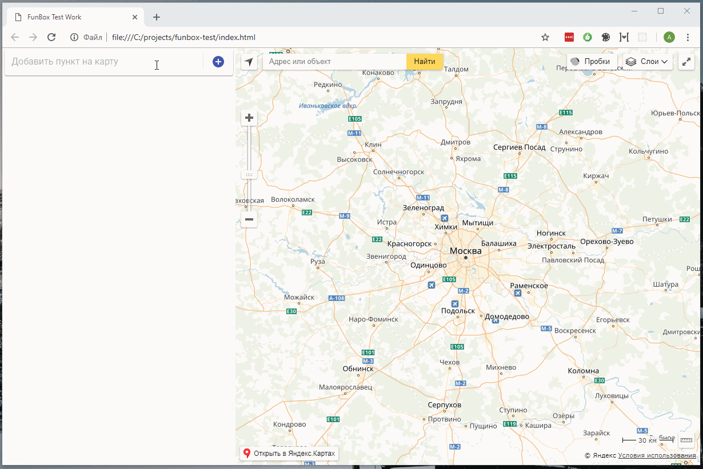

# FunBox Test Work

Test task for the position of frontend developer in the company FunBox.
The task is executed on technologies:

- React
- Redux
- TypeScript
- Material UI
- Yandex maps

## Task

[Task](materials/task.pdf)

# Level 1: Theoretical part

[Answer the question](materials/level1.md)

# Level 2: Application

## Install and run

You need install:

- [Node.js](https://nodejs.org) and [Npm](https://www.npmjs.com/)

Write in command line

```bash
git clone https://github.com/aleksnick/funbox-test.git
cd funbox-test
npm install
npm run start
```

If you encounter problems, run:

```bash
npm run build
```

and open `index.html` in your browser

## Run tests

Write in command line

```bash
npm run test
```

## How it looks


